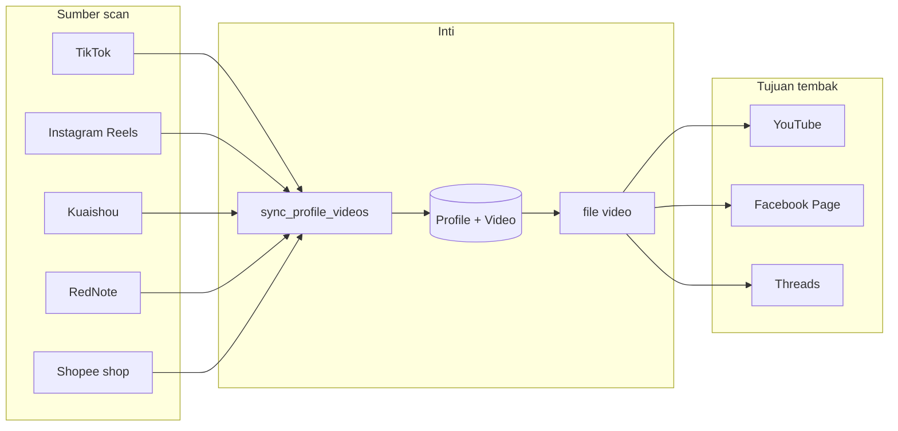

# Alur produk

Dokumen ini untuk programmer yang masuk ke repo `joefebrian/plugins`. Baca ini sebelum menambah platform.

Tujuan produk: scan video dari TikTok, Instagram, dan Facebook, lalu tembak file itu ke platform lain. Bentuk akhirnya plugin. Bentuk hari ini masih satu aplikasi.

## Apa yang sedang berjalan



Dua jalur autentikasi, jangan dicampur:

- Scan dan download pakai file cookie di `data/cookies/`. Cookie itu sesi browser platform sumber.
- Tembak pakai OAuth akun tujuan: YouTube, Facebook Page, Threads. Token disimpan di database, per user.

Akun aplikasi sendiri (login dashboard) terpisah lagi. Tabel `users`. Data profil terisolasi per `user_id`.

## Alur satu video

1. User login. `POST /api/auth/login`.
2. User tempel username atau URL profil. UI memanggil `POST /api/scan` dengan `{platform, username}`.
3. `src/web/app.py` `_run_scan` menjalankan `sync_profile_videos` di `src/services.py` lewat antrian `JobManager` (`src/web/jobs.py`). Job ada di memori proses. Restart server menghilangkan job yang sedang jalan.
4. `get_scraper` memilih adapter:
   - `tiktok` → `src/scrapers/tiktok.py` (butuh `platform_user_id` kalau ada)
   - `instagram` → `src/scrapers/instagram.py` (URL reels)
   - `kuaishou`, `rednote`, `shopee` → file scraper masing-masing
5. Scraper mengembalikan `VideoInfo`: id platform, url, judul, views, likes, waktu posting. Belum ada file.
6. `sync_profile_videos` membuat atau mengupdate baris `profiles` dan `videos`. Kunci unik video adalah `profile_id` + `platform_video_id`. Scan ulang hanya menambah yang baru dan mengupdate metrik.
7. Download: `POST /api/profiles/{id}/download` → `download_videos` → `src/downloader.py` (yt-dlp). File permanen masuk `data/downloads/`. `videos.is_downloaded` dan `file_path` terisi. Ada juga download langsung ke PC tanpa menyimpan file di server.
8. Tembak, hanya untuk video yang filenya ada:
   - `POST /api/profiles/{id}/youtube-upload` → `src/youtube/uploader.py`
   - `POST /api/profiles/{id}/facebook-upload` → `src/facebook/uploader.py`
   - `POST /api/profiles/{id}/threads-upload` → `src/threads/uploader.py`
9. Jejak tembakan disimpan terpisah supaya satu video bisa naik ke banyak akun:
   - `video_youtube_uploads`
   - `video_facebook_uploads`
   - `video_threads_posts`

Kolom `videos.youtube_video_id` masih ada dari versi lama. Jangan menambah kolom sejenis untuk platform baru. Pakai tabel jejak.

GMV dan komisi tidak datang dari scan. Angka itu diimpor (`src/gmv/`) lalu dashboard menjumlahkannya. Analisa produk membaca beberapa frame file video (`src/video_affiliate/`) dan menyimpan nama produk di `videos.affiliate_products_json`. File sementara analisa dihapus setelah selesai.

## Peta kode

| Bagian | Tempat |
| --- | --- |
| UI | `static/index.html`, `static/app.js` |
| HTTP | `src/web/app.py` dan `src/web/routes/` |
| Scan + daftar video | `src/services.py` |
| Adapter sumber | `src/scrapers/` |
| Download | `src/downloader.py` |
| Adapter tujuan | `src/youtube/`, `src/facebook/`, `src/threads/` |
| Model | `src/db/models.py` |
| Monitoring akun tujuan | `src/monitoring/`, `src/web/routes/monitoring.py` |

`get_scraper` menolak platform yang tidak terdaftar. Facebook tidak ada di situ. Menu Instagram Uploader dan X Uploader di UI masih nonaktif.

## Status platform

| Platform | Sebagai sumber scan | Sebagai tujuan tembak |
| --- | --- | --- |
| TikTok | Ya. Cookie + yt-dlp | Tidak |
| Instagram | Ya, lewat reels. Cookie + yt-dlp | Belum. Menu uploader mati |
| Facebook | Belum | Ya, ke Page yang di-OAuth |
| YouTube | Tidak. Hanya dipakai untuk baca video yang memang di-scan mereknya | Ya |
| Threads | Tidak | Ya |
| X | Tidak | Belum. Yang ada baru koneksi monitoring |
| Kuaishou | Ya | Tidak |
| RedNote | Ya | Tidak |
| Shopee shop | Ya, video produk toko | Tidak |
| Shopee Video kreator (`sv.shopee.co.id/profile/...`) | Tidak. Bukan bagian produk ini | Tidak |

## Kontrak plugin yang dituju

Platform baru tidak boleh menambah cabang besar di `app.py`. Satu platform = satu adapter yang mengisi kontrak ini.

```text
Source.scan(account) -> list[VideoInfo]
Store.upsert(profile, videos)          # sudah ada: sync_profile_videos
File.fetch(video) -> path               # sudah ada: download_videos
Destination.publish(video, account, file) -> remote_id
```

Sumber yang diminta berikutnya:

- TikTok dan Instagram sudah sumber. Rapikan supaya keduanya hanya kelas `Source`, cookie masuk lewat parameter, bukan lewat edit `services.py`.
- Facebook sebagai sumber hanya untuk Page yang akunnya sendiri yang connect, lewat API resmi daftar video Page itu. Jangan membuat scraper video orang lain.

Tujuan yang diminta berikutnya: setiap adapter `Destination` menulis satu baris jejak (akun tujuan, id remote, waktu, error). YouTube, Facebook, dan Threads sudah melakukan itu di tabel masing-masing. Plugin baru mengikuti pola tabel jejak, bukan kolom baru di `videos`.

## Urutan kerja

1. Keluarkan interface `Source` dan `Destination`. Pindahkan TikTok, Instagram, YouTube, Facebook, dan Threads ke belakang interface itu tanpa mengubah perilaku.
2. Tambah Instagram sebagai tujuan tembak. Scan-nya sudah ada.
3. Tambah Facebook sebagai sumber, hanya Page milik akun yang connect.
4. Pindahkan `JobManager` dari memori ke antrian yang tahan restart. Scan dan upload yang terputus harus kelihatan gagal, bukan hilang.
5. Satukan jejak publish kalau ketiga tabel mulai menyalin pola yang sama. Jangan lakukan ini sebelum interface tujuan stabil.

## Yang tidak dikerjakan

- Jangan menarik feed kreator Shopee Video. Halaman profil dan halaman share satu video bukan katalog. Jangan merangkai token, menebak id, atau melewati anti-bot.
- Jangan commit `data/`, `data/cookies/`, `data/auth.json`, atau `.env`. Sidecar SQLite `*.db-wal` dan `*.db-shm` juga jangan ikut.
- Jangan mencampur cookie sumber dengan token OAuth tujuan.
